# Duaal Leren

## Studio Hyperdrive

---

## Inspiration

---

## Front page

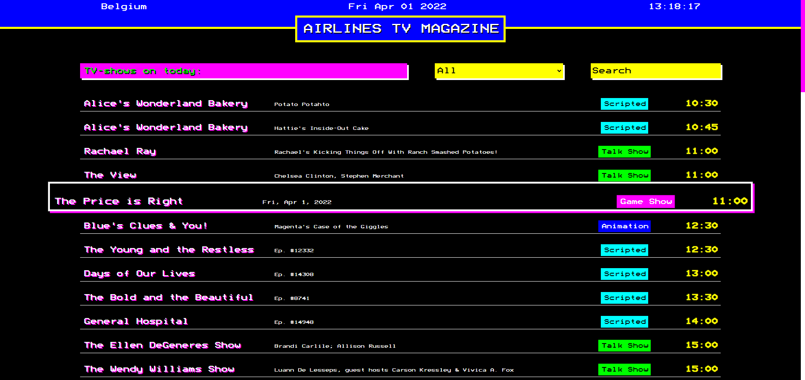

---

## Fuzzy search

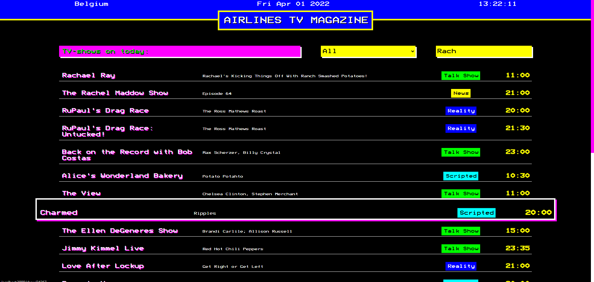

---

## Show Type Filters

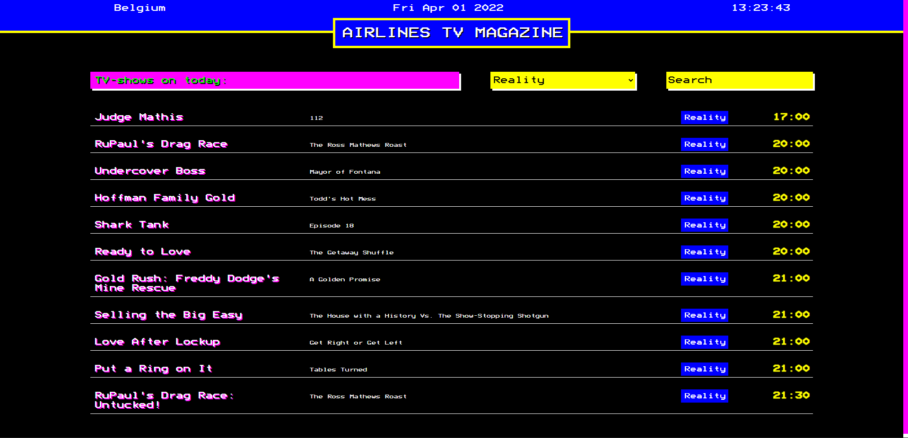

---

## Proud Code

### Location, Date & Time in Header

---

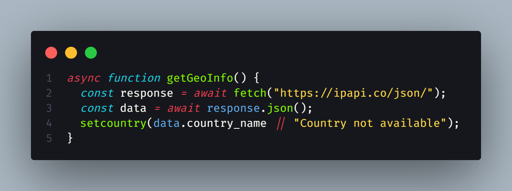

---

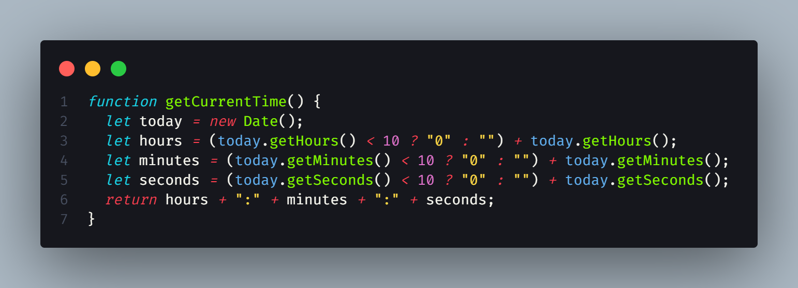

---

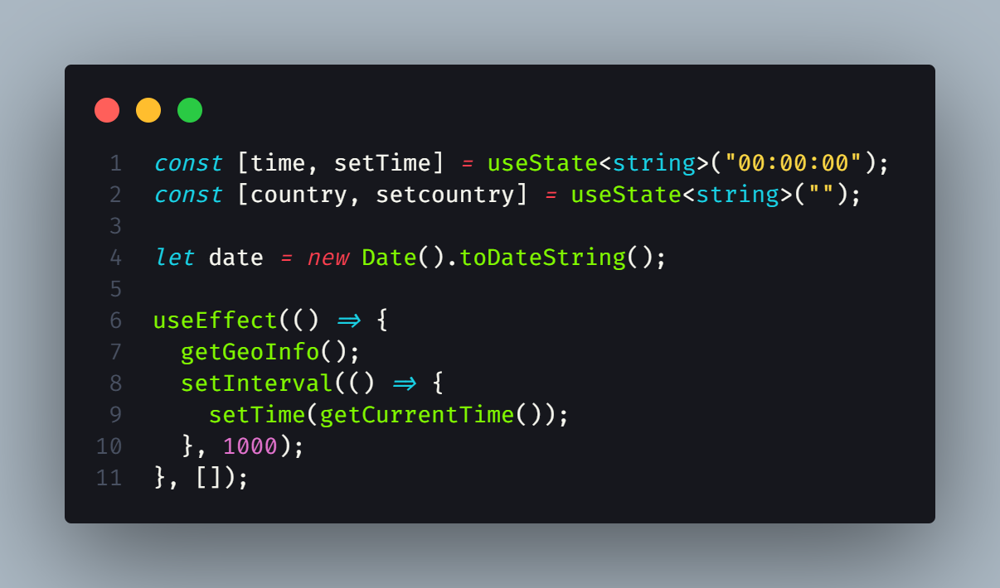

---

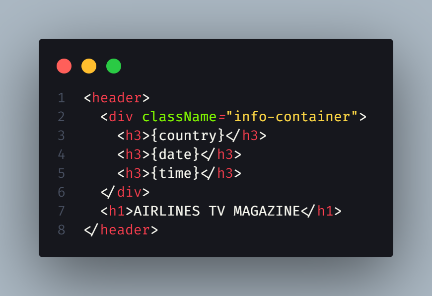

---

## Proud Code

### Fuzzy Search and Filters

---

### `Selectors.ts`

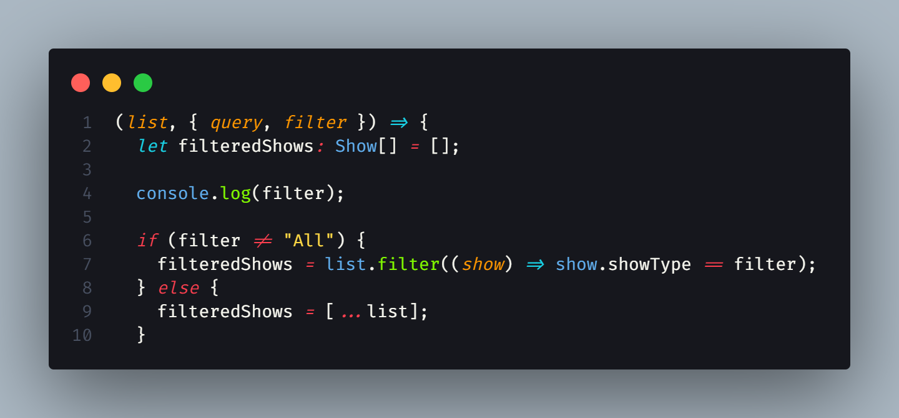

---

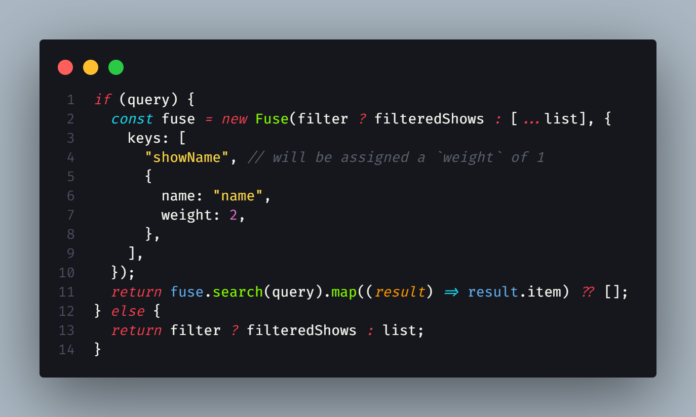

---

### `Overview.tsx`

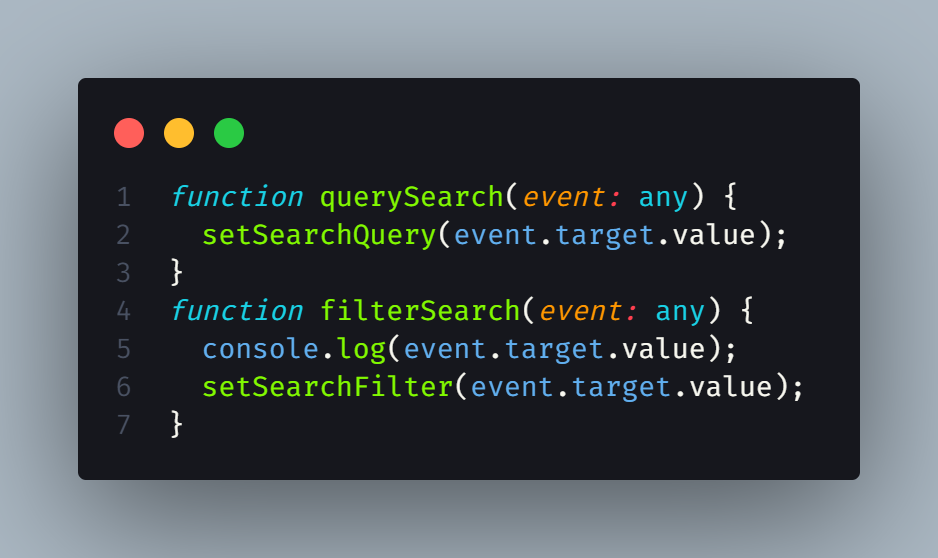

---

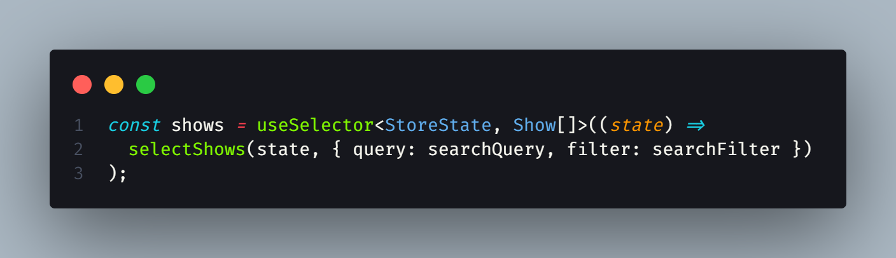

---

## Proud Code

### API Call

---

### `services/tvmaze.service.tsx`

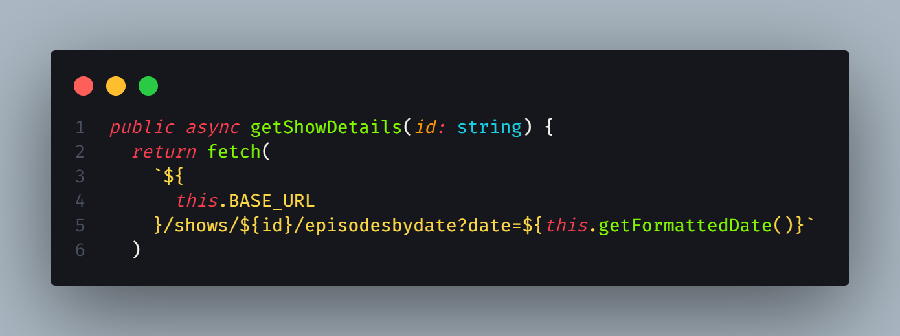

---

## Demo

---

## Thank you for your attention!
